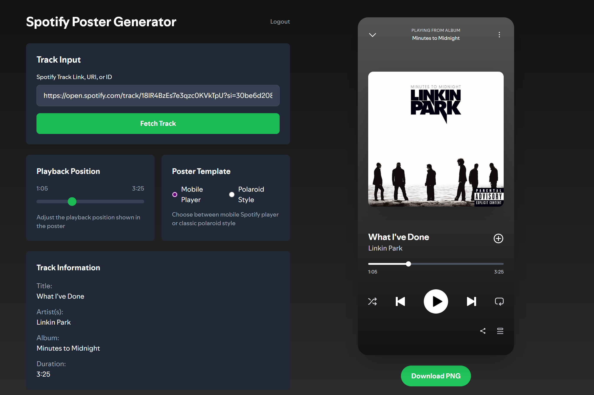

# Spotify Poster Generator

A client-side web application that generates beautiful Spotify-style poster images from track links. Built with React, Vite, and Tailwind CSS using Spotify's PKCE authentication flow.

<div align="center">

## Application Preview



</div>

## Features

- 🎵 **Track Input**: Accept Spotify URLs, URIs, or raw track IDs
- 🎨 **Pixel-Perfect Design**: Recreates Spotify's mobile player interface
- 🖼️ **Multiple Templates**: Choose between mobile player or polaroid-style designs
- 🎭 **Dynamic Theming**: Auto-extracts colors from album art for personalized gradients
- ⏱️ **Customizable Time**: Adjust the "paused at" moment with a slider
- 📱 **Responsive Design**: Works on desktop and mobile devices
- 🖼️ **High-Quality Export**: Download posters as PNG images with dom-to-image
- 🔐 **Secure Authentication**: Uses Spotify's PKCE flow (no backend required)

## Templates

Choose between two stylish templates for your Spotify track images:

<table>
<tr>
  <td width="50%" align="center"><strong>Mobile Player Style</strong></td>
  <td width="50%" align="center"><strong>Polaroid Style</strong></td>
</tr>
<tr>
  <td align="center"></td>
  <td align="center"></td>
</tr>
<tr>
  <td align="center"><em>A pixel-perfect recreation of Spotify's mobile player with accurate UI elements and dynamic background.</em></td>
  <td align="center"><em>A clean, modern take on the classic Polaroid format featuring album art with Spotify's dynamic color extraction.</em></td>
</tr>
</table>

</div>

## Setup

1. **Clone the repository**
   ```bash
   git clone https://github.com/your-username/polaroid-spotify.git
   cd polaroid-spotify
   ```

2. **Install dependencies**
   ```bash
   npm install
   ```

   The project uses these key dependencies:
   - `react` and `react-dom` - UI components
   - `dom-to-image` - For high-quality image generation
   - `prop-types` - For component prop validation

3. **Create Spotify App**
   - Go to [Spotify Developer Dashboard](https://developer.spotify.com/dashboard)
   - Create a new app
   - Add `http://localhost:5173/` as a redirect URI
   - Copy your Client ID

4. **Environment Configuration**
   ```bash
   cp .env.example .env
   ```

   Edit `.env` and add your Spotify credentials:
   ```
   VITE_SPOTIFY_CLIENT_ID=your_spotify_client_id_here
   VITE_SPOTIFY_REDIRECT_URI=http://localhost:5173/
   ```

5. **Start the development server**
   ```bash
   npm run dev
   ```

6. **Open your browser**
   Navigate to `http://localhost:5173`

## Usage

1. **Connect with Spotify**: Click the login button to authenticate
2. **Enter Track Info**: Paste any Spotify track URL, URI, or ID
3. **Fetch Track Data**: Click "Fetch Track" to load the song information
4. **Choose Template**: Select either "Mobile" (default) or "Polaroid" style
5. **Customize Time**: Use the slider to set the playback position
6. **Download**: Click "Download PNG" (or "Save Polaroid") to save your image

### Supported Input Formats

- **URL**: `https://open.spotify.com/track/18lR4BzEs7e3qzc0KVkTpU`
- **URI**: `spotify:track:18lR4BzEs7e3qzc0KVkTpU`
- **Track ID**: `18lR4BzEs7e3qzc0KVkTpU`

## Tech Stack

- **React 18** - UI framework
- **Vite** - Build tool and development server
- **Tailwind CSS** - Styling framework
- **dom-to-image** - High-quality image generation
- **Spotify Web API** - Track data and authentication
- **Color Analysis** - Dynamic extraction of album art colors

## Project Structure

```
src/
├── auth.js            # Spotify PKCE authentication
├── utils.js           # Utility functions (parsing, formatting, API calls)
├── SpotifyCanvas.jsx  # Rendering component with mobile and polaroid templates
├── SpotifyFonts.css   # Custom fonts for Spotify-accurate typography
├── App.jsx            # Main application component
├── main.jsx           # React entry point
└── index.css          # Global styles
```

## Features in Detail

### Authentication
- Uses Spotify's PKCE (Proof Key for Code Exchange) flow
- No backend required - fully client-side
- Automatic token refresh
- Persistent login state

### Image Rendering
- High-quality image generation using dom-to-image
- Multiple template options (Mobile or Polaroid style)
- 2x scale factor for crisp, high-resolution output
- Clean, modern polaroid style with Spotify's color scheme
- Exact recreation of Spotify's mobile player UI
- Dynamic album artwork loading with fallbacks
- Intelligent color extraction from album art for personalized gradients

### Responsive Design
- Two-column layout on desktop
- Stacked layout on mobile
- Optimized for various screen sizes

## Building for Production

```bash
npm run build
```

The build output will be in the `dist/` directory.

## Contributing

1. Fork the repository
2. Create a feature branch (`git checkout -b feature/amazing-feature`)
3. Commit your changes (`git commit -m 'Add some amazing feature'`)
4. Push to the branch (`git push origin feature/amazing-feature`)
5. Open a Pull Request

## License

This project is licensed under the MIT License - see the [LICENSE](LICENSE) file for details.

## Acknowledgments

- Spotify for providing the Web API
- The iconic Spotify design that inspired this project
- The React and Vite communities for excellent tooling
